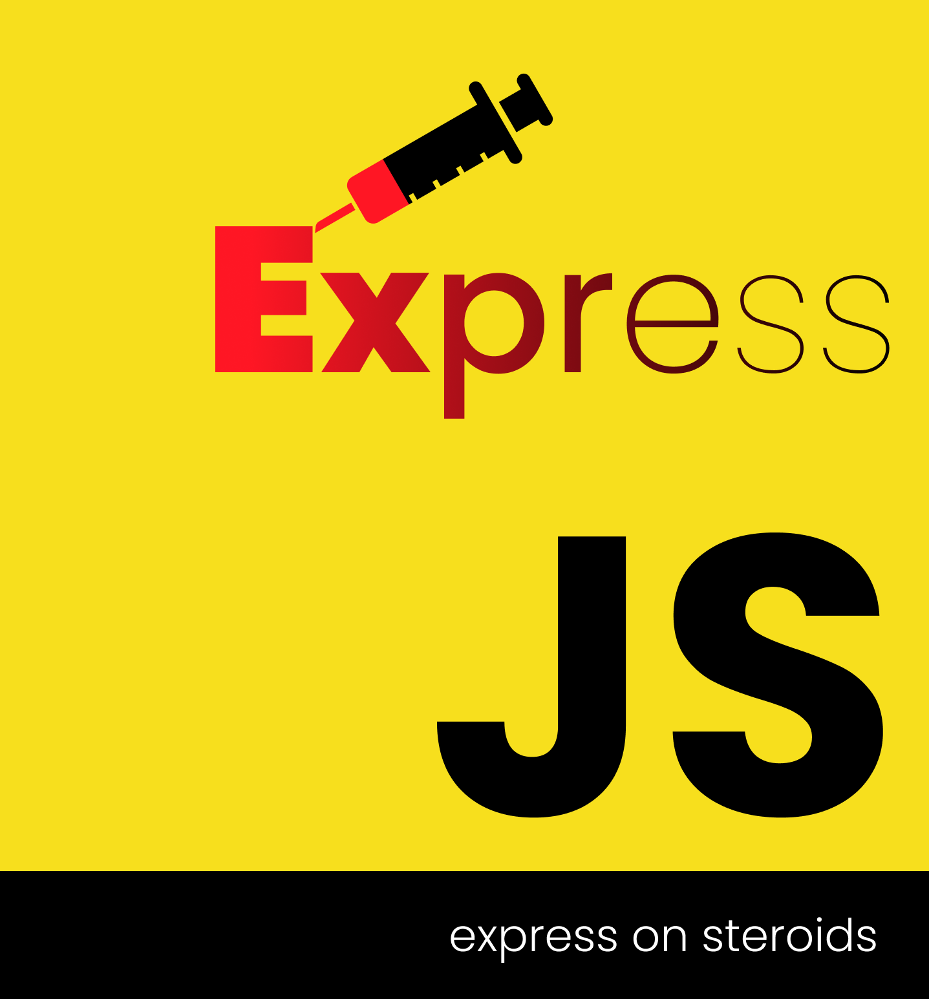

# Create Express on steroids app
 

Takes care of initialising an [express-on-steroids](https://github.com/Kreeda-Studios/express-on-steroids) project.

Just do
> npx @kreedalabs/create-eos-app test_api

and a new project directory `test_api` will be created containing all the necessary code for an express-on-steroids package.

* This script will also take care of install npm dependencies it requires.

